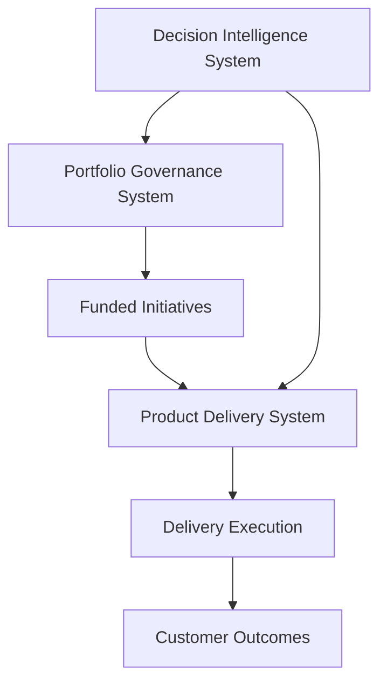

# Archived Repository

This repository represents an earlier design exploration of the Product Leadership Systems Architecture.

The concepts contained here have been consolidated into the unified architecture located in:

➡ https://github.com/ChuckFerrando/product-leadership-systems-architecture

The unified architecture integrates the following operating systems:

• Strategy Execution  
• Portfolio Governance  
• Product Delivery  
• Customer Outcomes  
• Decision Intelligence  

Readers should refer to the **Product Leadership Systems Architecture repository** for the current system model.

---

# Product Delivery System


---

## Overview

This repository documents a **product delivery system** used to translate portfolio strategy into product delivery outcomes.

The system defines how product organizations structure teams, manage roadmaps, govern delivery, and measure outcomes.

It complements the **enterprise portfolio operating system** by defining how funded initiatives are executed by product and engineering organizations.

---

## Role in the Product Leadership Systems Architecture



The Product Delivery System translates governed investments into executed initiatives and measurable customer outcomes.

It provides the operational structure for how product and engineering teams plan, build, release, and operate funded initiatives while maintaining delivery predictability and execution visibility for leadership.

---

## Operating Model

The Product Delivery System defines how product organizations execute funded initiatives through:

- team topology and ownership boundaries  
- roadmap shaping and release governance  
- product development lifecycle and quality gates  
- delivery cadence (weekly / sprint / monthly)  
- outcome measurement and feedback loops  

The goal of the operating model is to ensure that portfolio investments convert into delivered capabilities in a predictable and transparent manner.

---

## Core Components

The Product Delivery System typically includes the following operational elements:

- Team topology model (platform teams, product teams, enabling teams)  
- Product lifecycle framework (discover → deliver → operate)  
- Release governance and readiness criteria  
- Delivery review cadence and execution checkpoints  
- Delivery metrics model (predictability, throughput, quality, outcomes)

These components provide the structural foundation for managing product execution across multiple teams and initiatives.

---

## Governance Model

Delivery governance provides leadership visibility into execution health while maintaining team autonomy.

Typical governance layers include:

Weekly Execution Reviews  
Product and engineering leadership review delivery progress, blockers, and short-term risks.

Monthly Portfolio Delivery Reviews  
Cross-initiative dependencies, delivery risks, and resource alignment are evaluated.

Quarterly Outcomes Reviews  
Leadership reviews delivered capabilities against expected outcomes and adjusts investment priorities if necessary.

---

## Repository Structure

```
product-delivery-system
│
├── architecture
├── frameworks
├── templates
├── governance
├── artifacts
└── visualizations
```

Each directory represents a component of the product delivery operating system:

• **architecture** — system diagrams and delivery architecture documentation  
• **frameworks** — product lifecycle and delivery governance frameworks  
• **templates** — delivery review templates, release readiness checklists  
• **governance** — operating cadence, decision authorities, review structures  
• **artifacts** — example delivery outputs generated by the operating system  
• **visualizations** — delivery dashboards and execution visibility models

---

## Related Systems

This operating system is part of the broader **Product Leadership Systems Architecture**.

| System | Purpose | Repository |
|------|------|------|
| Strategy Execution System | Translates enterprise strategy into initiatives and portfolio-ready investments | https://github.com/ChuckFerrando/strategy-execution-system |
| Portfolio Governance System (Flagship) | Governs prioritization, capital allocation, delivery risk evaluation, and portfolio visibility | https://github.com/ChuckFerrando/portfolio-governance-system |
| Decision Intelligence System | AI-assisted analysis supporting portfolio governance and delivery decisions | https://github.com/ChuckFerrando/decision-intelligence-system |
| Architecture Portal | Documentation index for the full Product Leadership Systems Architecture | https://github.com/ChuckFerrando/product-leadership-systems |

---

## License

MIT License

Copyright (c) 2026 Chuck Ferrando

Permission is hereby granted, free of charge, to any person obtaining a copy
of this documentation and associated files to use, copy, modify, merge,
publish, distribute, sublicense, and/or sell copies, subject to the
following conditions:

The above copyright notice and this permission notice shall be included
in all copies or substantial portions of the documentation.

THE DOCUMENTATION IS PROVIDED "AS IS", WITHOUT WARRANTY OF ANY KIND.
